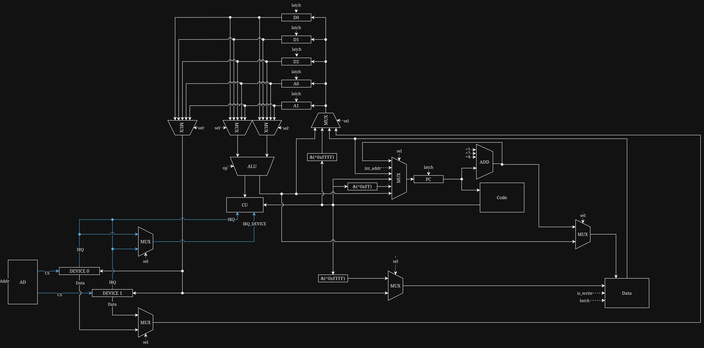

# Лабораторная работа №4 "Процессор и транслятор к нему"
[](https://github.com/NF-itmo/CSA-lab4/actions/workflows/lint.yaml)

Выполнил: Решетников Сергей\
Группа: P3208 

# Задание
forth | cisc | harv | hw | tick | binary | trap | port | cstr | prob1 | cache

Требования:
1. CISC процессор
2. Гарвардская архитектура памяти
3. forth-like язык
4. hardwired CU
5. Моделирование с точностью до такта
6. Бинарное представление машинного кода
7. Ввод-вывод через систему прерываний
8. PMIO
9. Null-terminated strings
10. Усложнение - работа с памятью через кэш с смиуляцией задержек

# Quick start
## Prepare
```bash
pip install "uv>=0.9cd ,<0.10"
uv sync
```
## Translator
```bash
uv run python ./src/Translator.py -s $SOURCE_PATH
```
```text
usage: Translator.py [-h] -s SOURCE [-c CODE_OUTPUT] [-d DATA_OUTPUT]
options:
  -h, --help            show this help message and exit
  -s, --source SOURCE   Path to source code
  -c, --code-output CODE_OUTPUT
                        Path to code memory binary output
  -d, --data-output DATA_OUTPUT
                        Path to data memory binary output
```
## Viewer
```bash
uv run python ./src/Viewer.py -c $CODE_BIN_PATH -d $DATA_BIN_PATH
```
```txt
usage: Viewer.py [-h] -c CODE -d DATA
options:
  -h, --help       show this help message and exit
  -c, --code CODE  Path to code memory dump
  -d, --data DATA  Path to data memory dump
```
## Machine
```bash
uv run python ./src/Machine.py -c $CODE_BIN_PATH -d $DATA_BIN_PATH -s $SETTINGS_PATH
```
```txt
usage: Machine.py [-h] -c CODE -d DATA -s SETTINGS
options:
  -h, --help            show this help message and exit
  -c, --code CODE       Path to code memory dump
  -d, --data DATA       Path to data memory dump
  -s, --settings SETTINGS
                        Path to settings file
```


# Описание языка

``` ebnf
program             ::= { top-level-word }

top-level-word      ::= statement
                      | definition
                      | interrupt-definition

definition          ::= ":" identifier { statement } ";"

interrupt-definition::= ":" interrupt-name { statement } ";"

interrupt-name      ::= "interruption_" unsigned-number

statement           ::= literal
                      | string-literal
                      | identifier
                      | declaration
                      | stack-op
                      | arithmetic-op
                      | compare-op
                      | memory-op
                      | control-flow
                      | io-op
                      | interrupt-op
                      | execute-op
                      | "bye"

literal             ::= number

string-literal      ::= '"' { string-char } '"'

declaration         ::= "variable" identifier
                      | number "allot" identifier
                      | number "constant" identifier
                      | string-literal "constant" identifier

stack-op            ::= "dup" | "drop" | "swap"

arithmetic-op       ::= "+" | "-" | "*" | "/" | "1+" | "1-"

compare-op          ::= "=" | ">" | "<"

memory-op           ::= "@" | "!"

control-flow        ::= if-statement
                      | do-loop

if-statement        ::= "if" { statement } "then" [ "else" { statement } ]

do-loop             ::= "do" { statement } "loop"

io-op               ::= "in" | "out"

interrupt-op        ::= "int"

execute-op          ::= "'" identifier
                      | "execute"

identifier          ::= non-space-token
                      - reserved-word
                      - number
                      - string-literal

number              ::= [ "+" | "-" ] digit { digit }

unsigned-number     ::= digit { digit }

reserved-word       ::= ":" | ";" | "if" | "else" | "then" | "do" | "loop"
                      | "variable" | "constant" | "allot"
                      | "+" | "-" | "*" | "/" | "1+" | "1-"
                      | "dup" | "drop" | "swap"
                      | "=" | ">" | "<"
                      | "@" | "!"
                      | "'" | "execute"
                      | "in" | "out" | "int" | "bye"

non-space-token     ::= non-space-char { non-space-char }

string-char         ::= ? any character except '"' ?

non-space-char      ::= ? any non-whitespace character ?

digit               ::= "0" | "1" | "2" | "3" | "4"
                      | "5" | "6" | "7" | "8" | "9"
```

Семантика основных слов:
- `variable name` создаёт одну ячейку данных и при использовании `name` кладёт её адрес на стек.
- `n allot name` создаёт блок из `n` ячеек данных и при использовании `name` кладёт адрес начала блока на стек.
- `n constant name` и `"..." constant name` создают константу; использование `name` кладёт значение константы на стек.
- `@` читает значение по адресу с вершины стека, `!` сохраняет значение по адресу со стека.
- `if` и `do` снимают predicate со стека: `0` означает false, любое другое значение — true.
- `in` читает из внешнего устройства, номер устройства берётся со стека; `out` пишет во внешнее устройство.
- `int` снимает номер прерывания со стека и вызывает `interruption_n`; обработчик объявляется как обычная функция, но завершается через `IRET`.

# Организация памяти

*Code memory*
```
+---------------------------------+
| 00  : LD reg=A0, operand=D      |
| 05  : LD reg=A1, operand=D+1024 |
| 0a  : jmp N                     |
|    ...                          |
| 0e  : interruption vector 0     |
| 12  : interruption vector 1     |
|    ...                          |
| n   : program start             |
|    ...                          |
| C   : halt                      |
+---------------------------------+
```
*Data memory*
```
+---------------------------------+
| 0   : any data                  |
| 1   : any data                  |
|    ...                          |
| D   : data stack start          | <- A0 init
|    ...                          |
| D+k : data stack top            | <- A0 runtime
|    ...                          |
| D+1024 : return stack start     | <- A1 init
|    ...                          |
| D+1024+k : return stack top     | <- A1 runtime
+---------------------------------+
```

`Data memory` адресуется по словам. Одно слово данных занимает 5 байт в бинарном файле, но полезное значение ограничено 32 битами. До запуска транслятор кладёт в начало памяти литералы, константы, переменные, `allot`-блоки и null-terminated строки в порядке их аллокации. Строки не выделяются в отдельную секцию в конце: каждая строка занимает подряд несколько слов в общей статической области и завершается нулём. После этой статической области начинается стек данных: его начальный адрес `D` загружается в `A0`. Return stack размещается отдельно, с отступом `1024` слов от начала стека данных: `D+1024` загружается в `A1`. Оба стека растут вверх.

# Datapath


To be continued...
