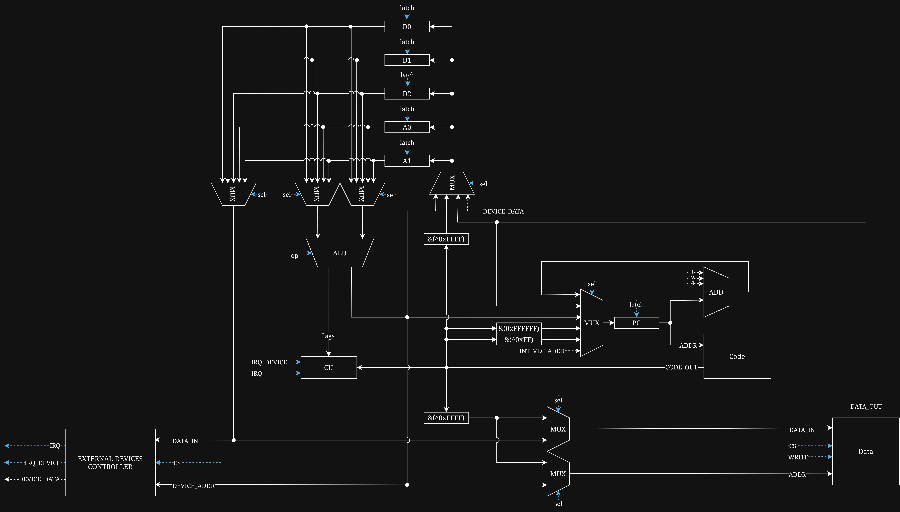
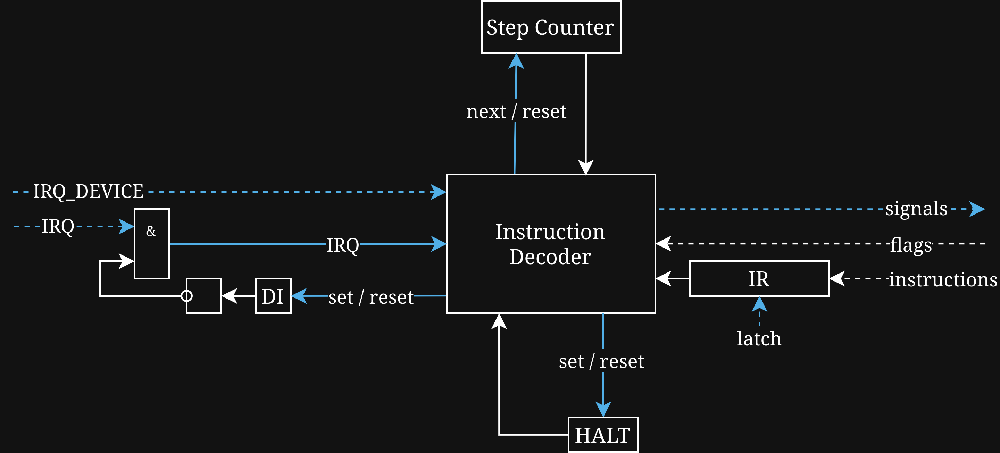
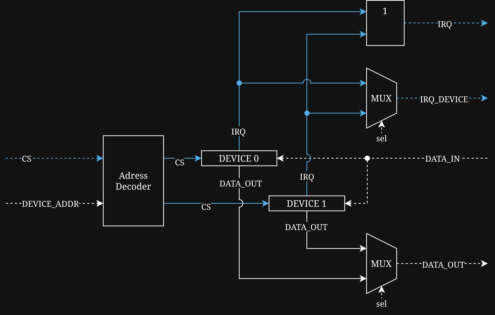
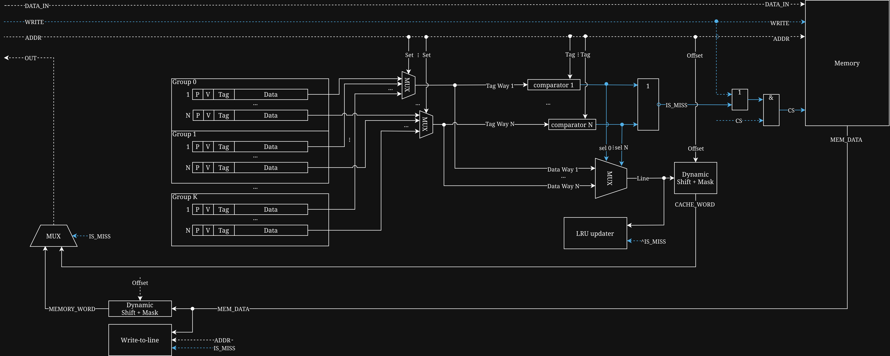

# Лабораторная работа №4 "Процессор и транслятор к нему"
[](https://github.com/NF-itmo/CSA-lab4/actions/workflows/lint.yaml)
[](https://github.com/NF-itmo/CSA-lab4/actions/workflows/test.yaml)

Выполнил: Решетников Сергей\
Группа: P3208 

# Задание
`forth | cisc | harv | hw | tick | binary | trap | port | cstr | prob1 | cache`

Требования:
1. CISC процессор
2. Гарвардская архитектура памяти
3. forth-like язык
4. hardwired CU
5. Моделирование с точностью до такта
6. Бинарное представление машинного кода
7. Ввод-вывод через систему прерываний
8. PMIO
9. Null-terminated strings
10. Усложнение - работа с памятью через кэш с симуляцией задержек

# Содержание

- [Quick start](#quick-start)
- [Описание языка](#описание-языка)
- [Таблица команд ISA](#таблица-команд-isa)
- [Форматы слов и адресов](#форматы-слов-и-адресов)
- [Обработка прерываний](#обработка-прерываний)
- [Организация памяти](#организация-памяти)
- [Кэш](#кэш-памяти-cache)
- [Схемы](#схемы)
- [Транслятор](#транслятор)
- [Модель процессора](#модель-процессора)
- [Тестирование](#тестирование)

# Quick start
## Prepare
```bash
pip install "uv>=0.9,<0.10"
uv sync
```
## Translator
```bash
uv run python ./src/Translator.py -s $SOURCE_PATH
```
```text
usage: Translator.py [-h] -s SOURCE [-c CODE_OUTPUT] [-d DATA_OUTPUT]
options:
  -h, --help            show this help message and exit
  -s, --source SOURCE   Path to source code
  -c, --code-output CODE_OUTPUT
                        Path to code memory binary output
  -d, --data-output DATA_OUTPUT
                        Path to data memory binary output
```
## Viewer
```bash
uv run python ./src/Viewer.py -c $CODE_BIN_PATH -d $DATA_BIN_PATH
```
```txt
usage: Viewer.py [-h] -c CODE -d DATA
options:
  -h, --help       show this help message and exit
  -c, --code CODE  Path to code memory dump
  -d, --data DATA  Path to data memory dump
```
## Machine
```bash
uv run python ./src/Machine.py -c $CODE_BIN_PATH -d $DATA_BIN_PATH -s $SETTINGS_PATH
```
```txt
usage: Machine.py [-h] -c CODE -d DATA -s SETTINGS
options:
  -h, --help            show this help message and exit
  -c, --code CODE       Path to code memory dump
  -d, --data DATA       Path to data memory dump
  -s, --settings SETTINGS
                        Path to settings file
```

## Пример полной цепочки
```bash
uv run python ./src/Translator.py -s ./test-examples/hello.fth -c ./src/exec_code -d ./src/exec_data
uv run python ./src/Viewer.py -c ./src/exec_code -d ./src/exec_data
uv run python ./src/Machine.py -c ./src/exec_code -d ./src/exec_data -s ./run.yaml
```


# Описание языка

``` ebnf
program              ::= { element }
element              ::= comment | definition | statement

definition           ::= ":" identifier { statement } ";"
                       | ":" interrupt-name { statement } ";"
interrupt-name       ::= "interruption_" unsigned-number

statement            ::= declaration
                       | control-flow
                       | stack-op
                       | arithmetic-op
                       | compare-op
                       | memory-op
                       | io-op
                       | interrupt-op
                       | poly-op
                       | execute-op
                       | literal
                       | string-literal
                       | identifier
                       | "bye"

declaration          ::= "variable" identifier
                       | number "allot" identifier
                       | ( number | string-literal ) "constant" identifier

control-flow         ::= if-statement | do-loop
if-statement         ::= "if" { statement } [ "else" { statement } ] "then"
do-loop              ::= "do" { statement } "loop"

stack-op             ::= "dup" | "drop" | "swap"
arithmetic-op        ::= "+" | "-" | "*" | "/" | "1+" | "1-"
compare-op           ::= "=" | ">" | "<"
memory-op            ::= "@" | "!"
io-op                ::= "in" | "out"
interrupt-op         ::= "int"
poly-op              ::= "poly" unsigned-number { number | identifier }
execute-op           ::= "'" identifier | "execute"

literal              ::= number
number               ::= [ "+" | "-" ] unsigned-number
unsigned-number      ::= digit { digit }
digit                ::= "0" | "1" | "2" | "3" | "4" | "5" | "6" | "7" | "8" | "9"

string-literal       ::= '"' { string-char } '"'
string-char          ::= ? any character except '"' ?

comment              ::= line-comment | block-comment
line-comment         ::= "\" { ? any char except newline ? } [ newline ]
block-comment        ::= "(" { ? any char except ')' ? } ")"

identifier           ::= non-space-token - reserved-word - number - string-literal
non-space-token      ::= non-space-char { non-space-char }
non-space-char       ::= ? any non-whitespace character ?

reserved-word        ::= ":" | ";" | "if" | "else" | "then" | "do" | "loop"
                       | "variable" | "constant" | "allot"
                       | "+" | "-" | "*" | "/" | "1+" | "1-"
                       | "dup" | "drop" | "swap"
                       | "=" | ">" | "<"
                       | "@" | "!"
                       | "'" | "execute"
                       | "in" | "out" | "int" | "poly" | "bye"
```

Семантика основных слов:
- `variable name` создаёт одну ячейку данных и при использовании `name` кладёт её адрес на стек
- `n allot name` создаёт блок из `n` ячеек данных и при использовании `name` кладёт адрес начала блока на стек
- `n constant name` и `"..." constant name` создают константу; использование `name` кладёт значение константы на стек
- `@` читает значение по адресу с вершины стека, `!` сохраняет значение по адресу со стека
- `if` и `do` снимают предикат со стека: `0` означает false, любое другое значение - true
- `in` читает из внешнего устройства, номер устройства берётся со стека; `out` пишет во внешнее устройство
- `int` снимает номер прерывания со стека и вызывает `interruption_n`; обработчик объявляется как обычная функция, но завершается через `IRET`
- `poly n c0 c1 ... cn` снимает `x` со стека и кладёт `c0 + c1*x + ... + cn*x^n`; коэффициенты вшиваются в машинный код

Семантика модели вычисления:
- Стратегия вычислений: стековая, слева направо по токенам; каждое слово немедленно компилируется в последовательность ISA-инструкций
- Области видимости: глобальная таблица имён; функции/обработчики прерываний объявляются через `: ... ;`, локальные переменные не поддерживаются
- Типизация: динамическая на уровне языка, но машинно все значения - целые 32-битные слова (`DATA_WORD_SIZE = 4`), арифметика знаковая `int32`
- Литералы: числовые литералы и execution token (`' name`) кладутся на data stack; строковые литералы встраиваются в data memory как `cstr` (последовательность слов + `0`-терминатор)
- Строки хранятся как `cstr`: один символ на один байт и нулевой терминатор
- Data stack хранится в `DataMemory`. `A0/DSP` указывает на текущую вершину стека: push сначала делает `A0 += DATA_WORD_SIZE`, затем пишет 32-битное слово в `DataMem[A0]`; pop читает `DataMem[A0]`, затем делает `A0 -= DATA_WORD_SIZE`
- Режим `(ST)` обращается к `DataMem[A0]` без изменения указателя. Режим `+(ST)` сначала увеличивает `A0`, затем обращается к новой вершине (прединкремент); режим `(ST)-` читает текущую вершину и затем уменьшает `A0` (постдекремент)

## Таблица команд ISA

Такты указаны как полное время выполнения инструкции при попаданиях в кэш

| Команда | Опкод | Такты | Поддерживаемые режимы | Описание |
|---|---:|---:|---|---|
| `NOP` | `0x00` | 4 | - | Переход к следующей инструкции |
| `HALT` | `0x71` | 3 | - | Остановка машины |
| `JMP addr` | `0x70` | 4 | `addr24` | Безусловный переход |
| `JZ mode, addr` | `0x72` | 4/8 | `mode in {D0,D1,D2,A0,A1,(ST),(ST)-}` | Переход при `mode == 0`; `(ST)-` дополнительно снимает predicate со стека |
| `JNZ mode, addr` | `0x73` | 4/8 | `mode in {D0,D1,D2,A0,A1,(ST),(ST)-}` | Переход при `mode != 0`; правила mode как у `JZ` |
| `MOV dst, src` | `0x30` | см. ниже | см. формы ниже | Пересылка между регистрами, памятью и стековыми режимами |
| `POLY n, c0..cn` | `0x31` | `Tpoly(n)` | implicit `(ST)` | Вычислить полином по схеме Горнера: `x` читается из `(ST)`, результат пишется в `(ST)` |
| `CALL mode, addr` | `0x60` | 5/10 | `IMM,addr` или `(ST)-,0` | Прямой вызов по `addr` или косвенный вызов по execution token со стека |
| `RET` | `0x62` | 5 | - | Возврат из функции |
| `INT (ST)-` | `0x50` | 11 | только `(ST)-` | Программное прерывание; номер прерывания явно снимается с data stack |
| `IRET` | `0x51` | 5 | - | Возврат из обработчика прерывания, разрешает прерывания |
| `PLS dst, src` | `0x01` | 4/14 | `REG,REG` или `(ST)-,(ST)` | Сложение; стековая форма выполняет `a b -- a+b` |
| `MIN dst, src` | `0x02` | 4/14 | `REG,REG` или `(ST)-,(ST)` | Вычитание; стековая форма выполняет `a b -- a-b` |
| `DIV dst, src` | `0x03` | 4/14 | `REG,REG` или `(ST)-,(ST)` | Деление; стековая форма выполняет `a b -- a/b` |
| `MUL dst, src` | `0x04` | 4/14 | `REG,REG` или `(ST)-,(ST)` | Умножение; стековая форма выполняет `a b -- a*b` |
| `EQ dst, src` | `0x20` | 4/14 | `REG,REG` или `(ST)-,(ST)` | Сравнение на равенство |
| `GT dst, src` | `0x21` | 4/14 | `REG,REG` или `(ST)-,(ST)` | Сравнение `>` |
| `LT dst, src` | `0x22` | 4/14 | `REG,REG` или `(ST)-,(ST)` | Сравнение `<` |
| `IN (ST)` | `0x40` | 10 | только `(ST)` | `DataMem[A0]` содержит device id и заменяется считанным словом |
| `OUT (ST),(ST)-` | `0x41` | 13 | только `(ST),(ST)-` | Записать value из второго элемента стека в устройство, id которого лежит на вершине |
| `INC mode` | `0x05` | 4/9 | `REG` или `(ST)` | Инкремент регистра или вершины data stack |
| `DEC mode` | `0x06` | 4/9 | `REG` или `(ST)` | Декремент регистра или вершины data stack |

Основные формы `MOV`:
| Команда | Такты | Описание |
| ------- | :---: | -------- |
| `MOV +(ST), IMM/REG`  | 4  | Кладёт значение на data stack                   |
| `MOV +(ST), MEM/(ST)` | 7  | Кладёт значение на data stack                   |
| `MOV (ST)-, (ST)`     | 4  | Удаляет вершину стека                           |
| `MOV (ST), IMM/REG`   | 4  | Заменяет вершину стека immediate/регистром      |
| `MOV (ST), MEM`       | 7  | Заменяет вершину стека словом из прямого адреса |
| `MOV (ST), (MEM)`     | 10 | Выполняет `addr -- DataMem[addr]`               |
| `MOV (MEM), (ST)-`    | 13 | Выполняет `value addr --` и пишет `value` в `DataMem[addr]` |
| `MOV MEM, (ST)`       | 7  | Пишет вершину стека в прямой адрес без pop      |
| `MOV MEM, (ST)-`      | 8  | Пишет вершину стека в прямой адрес и снимает её |
| `MOV REG, IMM`        | 4  | Пишет значение в регистр                        |
| `MOV REG, MEM`        | 5  | Пишет значение из памяти в регистр              |
| `MOV REG, REG`        | 4  | Копирует значение между регистрами              |
| `MOV REG, (ST)`       | 5  | Читает вершину стека в регистр без pop          |
| `MOV REG, (ST)-`      | 7  | снимает значение со стека в регистр             |

Для `POLY` при cache hit и степени `n`:
- `Tpoly(0) = 6`
- `Tpoly(n) = 7n + 10`, если `n > 0`

## Форматы слов и адресов

| Сущность                 | Размер  | Комментарий |
|--------------------------|--------:|---|
| `CODE_WORD_SIZE`         | 5 байт  | Окно выборки из памяти команд; кодовые слова читаются как big-endian |
| `DATA_WORD_SIZE`         | 4 байта | Машинное слово данных, signed `int32`, хранится как little-endian |
| `INTERRUT_SIZE`          | 3 байта | Одна запись таблицы векторов |
| Opcode                   | 1 байт  | Старший байт инструкции |
| Адрес инструкции/вектора | 24 бита | Диапазон `0x000000..0xFFFFFF` |

Формат машинной инструкции: `opcode(1B) + args(NB)`, где размер аргументов задаётся `Args` в `Config.py`.

## Кодирование инструкций

Общий формат: `opcode:8bit | arg0 | arg1 ...` (big-endian внутри машинного слова) \
`mode` кодируется в 4 бита. Двухоперандные команды используют descriptor-байт: старшая тетрада `dst/device`, младшая тетрада `src/value`
Режимы: `IMM`, `MEM`, `(MEM)`, `(ST)`, `+(ST)`, `(ST)-`, `D0`, `D1`, `D2`, `A0`, `A1`

| Инструкции                           | Формат  |
|--------------------------------------|---------|
| `RET/IRET/HALT`                      | `opcode(1B)` |
| `MOV`                                | `opcode(1B) + descriptor(dst/src,1B) + operand(3B)` |
| `PLS/MIN/DIV/MUL/EQ/GT/LT`           | `opcode(1B) + descriptor(dst/src,1B)` |
| `INC/DEC/IN/INT`                     | `opcode(1B) + mode(1B)` |
| `OUT`                                | `opcode(1B) + descriptor(device/value,1B)` |
| `JMP`                                | `opcode(1B) + target_addr(3B)` |
| `JZ/JNZ/CALL`                        | `opcode(1B) + mode(1B) + target_addr(3B)` |
| `POLY`                               | `opcode(1B) + degree(1B) + coeff0(3B) + ... + coeffN(3B)` |

Архитектура классифицируется как CISC: переменная длина инструкций, несколько режимов адресации, инструкции с доступом к памяти и стекам за одну команду

## Обработка прерываний

### Внешнее прерывание (IRQ от устройства)
1. На границе инструкций, перед `FETCH1`, CU проверяет общий `irq` при `DI=0`
2. Если `irq=1`, CU перебирает `DevicesIrqMux.sel` от `0` до `INTERRUPT_COUNT-1` до появления сигнала `IRQ_DEVICE` (т.е. до обнаружения первого источника)
3. `IRQ_DEVICE_SEL` остаётся выставленным на найденное устройство, `DI` устанавливается в `1`, вложенные прерывания запрещены
4. CU включает IRQ-service selector адреса устройства и читает слово выбранного устройства через `AddressDecoder -> CS`
5. Считанное значение кладётся на data stack
6. Текущий `PC` сохраняется в return stack
7. Вычисляется адрес вектора: `vector_base + device_idx * INTERRUT_SIZE`
8. Из таблицы векторов читается адрес обработчика, `PC` получает этот адрес

Вход внешнего устройства моделируется одним pending-слотом. Если к моменту нового события старое значение ещё не было прочитано через `CS` в режиме чтения, старое значение безвозвратно перезаписывается новым; `irq` остаётся поднятым для последнего доступного значения

### Программное прерывание (`INT (ST)-`)
1. `INT (ST)-` снимает с вершины data stack номер прерывания
2. Дальше выполняется тот же переход через таблицу векторов: сохранение `PC`, переход в обработчик, установка `DI=1`

### Возврат из обработчика (`IRET`)
1. Из return stack снимается адрес возврата и загружается в `PC`
2. `DI` сбрасывается в `0`, после этого снова разрешены новые прерывания

# Организация памяти

*Code memory*
```
+---------------------------------+
| 00  : MOV A0, IMM D-4           |
| 05  : MOV A1, IMM R             |
| 0a  : jmp N                     | <- Boot section finish
|    ...                          |
| 0e  : interruption vector 0     |
| 11  : interruption vector 1     |
|    ...                          |
| N   : program start             |
|    ...                          |
| C   : halt                      |
+---------------------------------+
```
*Data memory*
```
+---------------------------------+
| 0   : any data                  |
| 1   : any data                  |
|    ...                          |
| D-4 : empty data stack sentinel | <- A0 init
| D   : first data stack word     |
|    ...                          |
| D+k : data stack top            | <- A0 runtime
|    ...                          |
| R   : return stack first cell   | <- A1 init
|    ...                          |
| R+k : return stack top          |
| R+k+1 : return stack next free  | <- A1 runtime
+---------------------------------+
```

`Code memory` адресуется побайтно и трактуется как big-endian. В её начале лежат две инструкции инициализации (`MOV A0,IMM D-4`, `MOV A1,IMM R`), затем `JMP` на старт программы, затем таблица векторов прерываний (по `INTERRUT_SIZE=3` байта на вектор), затем основной код

`Data memory` адресуется побайтно и хранит машинные числа как 32-битные signed little-endian слова, поэтому `@`/`!` читают и пишут 4 байта по указанному байтовому адресу. Строки `cstr` занимают один байт на символ и завершаются нулевым байтом; транслятор добавляет padding-ноли после терминатора, чтобы чтение 32-битного слова с адреса терминатора давало `0`. После статической области начинается data stack: адрес первой стековой ячейки `D` выравнивается по `DATA_WORD_SIZE = 4`, а начальное значение пустого стека `D-4` загружается в `A0`. Return stack размещается отдельным диапазоном: его стартовый адрес `R` вычисляется транслятором и загружается в `A1`. Оба стека растут вверх

Data stack представлен в памяти: `A0` указывает на текущую вершину стека. Режим `+(ST)` сначала увеличивает `A0` на `DATA_WORD_SIZE = 4`, затем пишет в новую вершину; режим `(ST)-` читает текущую вершину и затем уменьшает `A0` на `DATA_WORD_SIZE = 4`; режим `(ST)` обращается к `A0` без изменения глубины

Правила отображения сущностей в память:
- Инструкции, векторы прерываний, обработчики: только в `Code memory`
- Процедуры языка: располагаются в секции программы, адрес процедуры сохраняется в таблице символов транслятора
- Векторы прерываний: фиксированная таблица в начале `Code memory`, запись адресов обработчиков по формуле `base + idx * INTERRUT_SIZE`
- Числовые литералы: дедуплицируются в статической области `Data memory`; при использовании компилятор берёт адрес готового литерала
- Строковые литералы (`cstr`): размещаются в `Data memory` как последовательность байтов и завершающий `0`
- `variable`/`allot`: всегда статическая область `Data memory`; имя слова на этапе выполнения кладёт на стек адрес
- Динамические данные: data stack (`A0`) и return stack (`A1`) в `Data memory`

## Кэш памяти (`cache`)

| Характеристика | Значение |
|---|---|
| Размещение | Отдельные `CodeCache` и `DataCache`, каждый над своей памятью |
| Размер линии | `CACHE_LINE_SIZE_BYTES = 16` байт |
| Число линий | `CACHE_LINE_COUNT = 16` |
| Ассоциативность | `CACHE_WAY_COUNT = 4`-way set associative |
| Вытеснение | LRU внутри набора |
| Write hit | Write-back: обновляется линия, выставляется `dirty` |
| Write miss | No-write-allocate: запись сразу в нижнюю память |
| Read hit | Без дополнительной задержки |
| Read miss | `CACHE_MISS_TICKS = 10` тактов на недостающую линию |

### Разбиение адреса в кэше

Оба кэша работают с байтовыми адресами внутри кэш-линий
`byte_addr` раскладывается на следующие битовые поля:

```text
byte_addr = [ tag ][ set_idx ][ offset ]
            [ ... ][ 2 бита  ][ 4 бита ]

offset  =  byte_addr        & 0b1111
set_idx = (byte_addr >> 4)  & 0b11
tag     =  byte_addr >> 6
```

То есть:
- `offset` выбирает байт смещение 16-байтовой кэш-линии
- `set_idx` выбирает один из 4 наборов (`0..3`)
- `tag` хранится в строке кэша и отличает разные адреса, попавшие в один набор

В конфиге симуляции кэш можно включать и выключать:
```yaml
cache_enabled: true   # по умолчанию
# или
cache: false
```

При `cache_enabled: false` `CodeCache` и `DataCache` работают как bypass к нижней памяти: данные не сохраняются в cache-line, но каждое новое обращение к памяти всё равно получает задержку `CACHE_MISS_TICKS`

В логах доступны cache-метрики:
```yaml
{cache:code:hitRate:dec}
{cache:data:hitRate:pct}
{cache:total:hits:dec}
{cache:total:misses:dec}
{cache:total:accesses:dec}
{cache:total:enabled:bool}
```
Источники: `code`, `data`, `total`. Для `hitRate` формат `dec` печатает долю `0.0000..1.0000`, `pct`/`percent` печатает проценты.

#### Бенчмарк

Скрипт [src/CacheBenchmark.py](src/CacheBenchmark.py) прогоняет golden-тесты на нескольких конфигурациях кэша и печатает Markdown-таблицу:

```bash
python -m src.CacheBenchmark
python -m src.CacheBenchmark --per-test
python -m src.CacheBenchmark --only poly --per-test
```

Сравниваемые варианты:
- `latency`: кэш отключён, но каждый доступ к нижней памяти всё равно ждёт `CACHE_MISS_TICKS`; это baseline без hit-ов
- `4way_line32_cap256`: 4-way, линия 32 байта, суммарно 256 байт
- `2way_line16_cap256`: 2-way, линия 16 байт, суммарно 256 байт
- `4way_line16_cap256`: 4-way, линия 16 байт, суммарно 256 байт
- `2way_line32_cap256`: 2-way, линия 32 байта, суммарно 256 байт

| test                | variant            | ticks  | total HR | total acc | total hits | total miss | code HR | data HR |
|---------------------|--------------------|--------|----------|-----------|------------|------------|---------|---------|
|   cat               | latency            | 1250   | 0.00%    | 96        | 0          | 96         | 0.00%   | 0.00%   |
| **cat**             | 4way_line32_cap256 | 671    | 95.31%   | 192       | 183        | 9          | 94.25%  | 96.19%  |
|   cat               | 4way_line16_cap256 | 669    | 89.63%   | 164       | 147        | 17         | 86.67%  | 92.13%  |
| **cat**             | 2way_line32_cap256 | 671    | 95.31%   | 192       | 183        | 9          | 94.25%  | 96.19%  |
|   cat               | 2way_line16_cap256 | 669    | 89.63%   | 164       | 147        | 17         | 86.67%  | 92.13%  |
| |
|   double            | latency            | 27263  | 0.00%    | 2136      | 0          | 2136       | 0.00%   | 0.00%   |
|   double            | 4way_line32_cap256 | 6983   | 94.94%   | 2136      | 2028       | 108        | 88.59%  | 98.80%  |
|   double            | 4way_line16_cap256 | 7323   | 93.35%   | 2136      | 1994       | 142        | 84.86%  | 98.50%  |
| **double**          | 2way_line32_cap256 | 6873   | 95.46%   | 2136      | 2039       | 97         | 89.95%  | 98.80%  |
|   double            | 2way_line16_cap256 | 7123   | 94.29%   | 2136      | 2014       | 122        | 87.34%  | 98.50%  |
| |
|   hello             | latency            | 6205   | 0.00%    | 481       | 0          | 481        | 0.00%   | 0.00%   |
| **hello**           | 4way_line32_cap256 | 1525   | 97.30%   | 481       | 468        | 13         | 97.49%  | 97.16%  |
|   hello             | 4way_line16_cap256 | 1575   | 96.26%   | 481       | 463        | 18         | 95.98%  | 96.45%  |
| **hello**           | 2way_line32_cap256 | 1525   | 97.30%   | 481       | 468        | 13         | 97.49%  | 97.16%  |
|   hello             | 2way_line16_cap256 | 1575   | 96.26%   | 481       | 463        | 18         | 95.98%  | 96.45%  |
| |
|   hello_user_name   | latency            | 16953  | 0.00%    | 1316      | 0          | 1316       | 0.00%   | 0.00%   |
| **hello_user_name** | 4way_line32_cap256 | 4743   | 97.92%   | 1538      | 1506       | 32         | 97.93%  | 97.91%  |
|   hello_user_name   | 4way_line16_cap256 | 4893   | 96.94%   | 1538      | 1491       | 47         | 96.81%  | 97.04%  |
|   hello_user_name   | 2way_line32_cap256 | 4993   | 96.29%   | 1538      | 1481       | 57         | 97.61%  | 95.39%  |
|   hello_user_name   | 2way_line16_cap256 | 5033   | 96.03%   | 1538      | 1477       | 61         | 96.33%  | 95.83%  |
| |
|   poly              | latency            | 374    | 0.00%    | 28        | 0          | 28         | 0.00%   | 0.00%   |
| **poly**            | 4way_line32_cap256 | 154    | 78.57%   | 28        | 22         | 6          | 80.00%  | 76.92%  |
|   poly              | 4way_line16_cap256 | 194    | 64.29%   | 28        | 18         | 10         | 66.67%  | 61.54%  |
| **poly**            | 2way_line32_cap256 | 154    | 78.57%   | 28        | 22         | 6          | 80.00%  | 76.92%  |
|   poly              | 2way_line16_cap256 | 194    | 64.29%   | 28        | 18         | 10         | 66.67%  | 61.54%  |
| |
|   problem1          | latency            | 968141 | 0.00%    | 75712     | 0          | 75712      | 0.00%   | 0.00%   |
|   problem1          | 4way_line32_cap256 | 231851 | 97.25%   | 75712     | 73629      | 2083       | 91.78%  | 99.98%  |
|   problem1          | 4way_line16_cap256 | 247841 | 95.14%   | 75712     | 72030      | 3682       | 85.46%  | 99.96%  |
| **problem1**        | 2way_line32_cap256 | 231841 | 97.25%   | 75712     | 73630      | 2082       | 91.78%  | 99.98%  |
|   problem1          | 2way_line16_cap256 | 247861 | 95.13%   | 75712     | 72028      | 3684       | 85.45%  | 99.96%  |
| |
|   sort              | latency            | 3000000 | 0.00%   | 232046    | 0          | 232046     | 0.00%   | 0.00%   |
| **sort**            | 4way_line32_cap256 | 11469  | 97.42%   | 3796      | 3698       | 98         | 93.59%  | 99.59%  |
|   sort              | 4way_line16_cap256 | 12089  | 95.79%   | 3796      | 3636       | 160        | 89.43%  | 99.38%  |
|   sort              | 2way_line32_cap256 | 12249  | 95.36%   | 3796      | 3620       | 176        | 87.90%  | 99.59%  |
|   sort              | 2way_line16_cap256 | 12539  | 94.60%   | 3796      | 3591       | 205        | 86.15%  | 99.38%  |


# Схемы

**DataPath**


**ControlUnit**


**External Devices Controller**


**N-way associative cache**


# Транслятор

CLI интерфейс:
- Вход: исходный `.fth` (`-s`) и пути выходных бинарников (`-c`, `-d`)
- Выход: `code` (память команд, binary) и `data` (память данных, binary)

Принципы работы:
1. Лексический разбор: токенизация Forth-кода, включая строковые литералы и комментарии (`\ ...` и `( ... )`)
2. Генерация кода
3. Построение памяти:
   - формирование статической области `Data memory`
   - формирование `Code memory` с префиксом `MOV A0,IMM`, `MOV A1,IMM`, `JMP start`
   - запись таблицы векторов прерываний и адресов обработчиков
4. Сериализация в настоящие бинарные файлы (`binary` вариант)

Пайплайн трансляции:
```text
.fth
  -> tokenize
  -> emit ISA with labels and patch-addresses
  -> build CodeMemory image
  -> build DataMemory image
  -> binary code/data dumps
```

Основные инварианты генерации:
- Токены компилируются слева направо
- Значения языка передаются через data stack
- Управляющие конструкции (`if`, `do`, `loop`, вызовы слов) сначала получают символические label-ы, а после определения адресов патчатся в машинные `JMP/JZ/JNZ/CALL`
- Все строки компилируются как `cstr` в `DataMemory`: один символ на байт и завершающий `0`

# Модель процессора

Модель выполнена как tick-accurate эмуляция с netlist-компонентами:
- DataPath: регистры `D0..D2`, `A0` (DSP), `A1` (RSP), `PC`, `DI`; ALU; мультиплексоры; память команд/данных; внешние устройства
- Control Unit: hardwired (`hw`) в `CU2.tick` с последовательностью микроопераций по тактам
- Ввод-вывод: `port-mapped`, через `IN`/`OUT` и `AddressDecoder` + `CS`
- Прерывания: `trap`-модель с общим `irq`, поиском источника перебором `DevicesIrqMux`, переходом по таблице векторов; вложенные прерывания блокируются `DI`

## Control Unit

Основная модель находится в `src/Machine.py` и использует класс `CU2`. CU хранит текущую инструкцию в `IR`, а номер текущего микрошагa - в `STEP_COUNTER`. На каждом внешнем `GLOBAL_NETLIST.tick()` CU только выставляет управляющие сигналы: защёлки регистров, селекторы mux-ов, режимы ALU/памяти/устройств и константу для `PCAdder`

### Фазы исполнения инструкции

Один внешний такт симуляции - это один вызов `GLOBAL_NETLIST.tick()`: сначала схема стабилизируется, затем тактируются компоненты, затем схема снова стабилизируется

В обычном цикле инструкции `STEP_COUNTER` интерпретируется так:

```text
STEP_COUNTER = 0, FETCH1:
    если DI=0 и irq=1:
        перейти в IRQ entry sequence
    иначе:
        IR.latch <- open
        STEP_COUNTER <- STEP_COUNTER + 1
```

```text
STEP_COUNTER = 1, FETCH2:
    IR.latch <- closed
    STEP_COUNTER <- STEP_COUNTER + 1
```

```text
STEP_COUNTER >= 2, EXEC:
    opcode,args <- decode(IR)
    exec_step <- STEP_COUNTER - 1
    выполнить микрошаг exec_step текущей инструкции

    если инструкция не завершена:
        STEP_COUNTER <- STEP_COUNTER + 1

    если инструкция завершена:
        PC <- адрес следующей инструкции или адрес перехода
        STEP_COUNTER <- 0
```

`FETCH1` открывает защёлку `IR`, поэтому текущее окно `CodeMem[PC]` попадает на вход instruction register. `FETCH2` закрывает `IR`, и со следующего такта микрокод работает уже со стабильной копией инструкции. `PC` обычно изменяется в последнем `EXEC`-микрошаге инструкции, а не во время `FETCH`

Если `CodeMem` или `DataMem` занята обработкой cache miss, CU не меняет фазу: защёлки остаются закрытыми, `STEP_COUNTER` не инкрементируется, и текущая микрооперация продолжится после снятия `busy`

Внешний IRQ обрабатывается между инструкциями:

```text
STEP_COUNTER = 0 и DI=0 и irq=1:
    IRQ_ENTRY <- 1
    STEP_COUNTER <- 1
```

В `IRQ_ENTRY` сначала перебирается `DevicesIrqMux.sel`. Когда найден первый активный источник, `IRQ_DEVICE_SEL` остаётся выбранным, `DI` устанавливается в `1`, а `STEP_COUNTER` сбрасывается. После этого начинается service-фаза: CU читает слово внешнего устройства, кладёт его на data stack, сохраняет текущий `PC` в return stack, загружает адрес записи таблицы векторов и затем переводит `PC` на адрес обработчика. `IRET` снимает адрес возврата из return stack и сбрасывает `DI`

# Тестирование

Golden-тесты находятся в [test/golden](test/golden):
- [hello](test/golden/hello.yaml)
- [cat](test/golden/cat.yaml)
- [hello_user_name](test/golden/hello_user_name.yaml)
- [sort](test/golden/sort.yaml)
- [double](test/golden/double.yaml)
- [poly](test/golden/poly.yaml)
- [problem1](test/golden/problem1.yaml)

Что покрывается тестами:
- базовый вывод
- потоковый ввод/вывод через прерывания
- работа со строками `cstr`
- сортировка и арифметика расширенной точности
- variable-length инструкция `POLY`
- оптимизированный алгоритм `prob1` (Euler #4)

Оптимизация `problem1`:
- вместо перебора всех произведений трёхзначных чисел программа генерирует шестизначные палиндромы сверху вниз
- для палиндрома `abccba` проверяются только делители, кратные `11`, так как любой шестизначный палиндром делится на `11`
- первый найденный палиндром с двумя трёхзначными множителями сразу является ответом, поэтому программа останавливает поиск и печатает `906609`

| Тест | Что проверяет | Ожидаемый эффект |
|---|---|---|
| `hello.yaml` | Печать null-terminated строки через `INT` | `Hello World!` в output устройства |
| `cat.yaml` | Ввод через внешний IRQ и короткий ISR echo | Входной поток полностью переходит в output |
| `hello_user_name.yaml` | Диалоговая строка, ожидание `0`-терминатора | Приветствие с именем пользователя |
| `sort.yaml` | Накопление входа через IRQ и сортировка | Отсортированная последовательность |
| `double.yaml` | Арифметика двойной точности средствами языка | Вывод результата как пары 32-битных слов |
| `poly.yaml` | Variable-length инструкция `POLY` | Вычисление полинома и вывод результата |
| `problem1.yaml` | Оптимизированный Euler #4 | `906609` |

Формат golden-кейса:
- `in_src` - исходник алгоритма
- `in_simulation_conf` - конфиг симуляции (`limit`, `cache_enabled`, `port_mapped_io`, `result`, `assert`)
- `out_code_binary_hex` и `out_data_binary_hex` - ожидаемые бинарники
- `out_code_view` - ожидаемый вывод viewer
- `out_machine` - ожидаемый финальный вывод машины

Golden-файл самодостаточен для ревью: в нём лежит исходная программа, расписание внешнего ввода, ожидаемый binary dump, ожидаемый дизассемблированный view и ожидаемый результат симуляции

Расписание входа для PMIO задаётся в `in_simulation_conf.port_mapped_io`:
```yaml
port_mapped_io:
  0:
  - - 50000
    - A
  - - 70000
    - l
  - - 90000
    - i
```

Каждая запись означает `tick, value`: в указанный такт внешний девайс получает новое pending-значение и поднимает IRQ. `value` может быть символом или числом. Если предыдущее pending-значение не было прочитано программой до прихода следующего события, оно перезаписывается новым значением

В `result.view` можно собирать как финальные результаты, так и фрагменты тактовой трассы. Наиболее полезные источники для шаблонов:
| Источник | Пример | Что показывает |
|---|---|---|
| Регистры | `{PC:dec}`, `{D0:hex}`, `{A0:hex}` | состояние datapath |
| Инструкция | `{instruction:str}` | мнемоника текущего `IR` |
| Прерывания | `{DI:bool}` | находится ли машина внутри обработчика |
| PMIO | `{pmio:0:input:sym}`, `{pmio:0:output:sym}` | буферы внешнего устройства |
| Кэш | `{cache:total:hitRate:pct}` | cache-метрики |

Запуск:
```bash
uv run pytest
```
